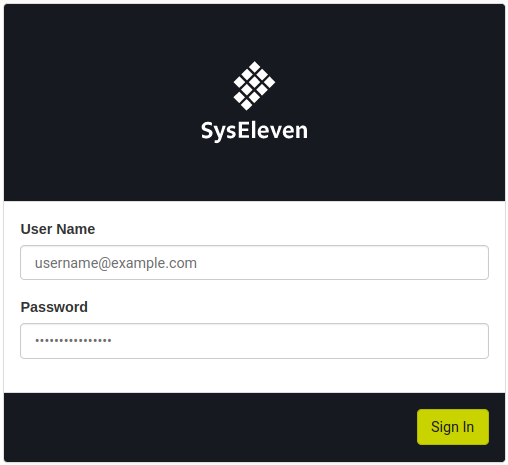
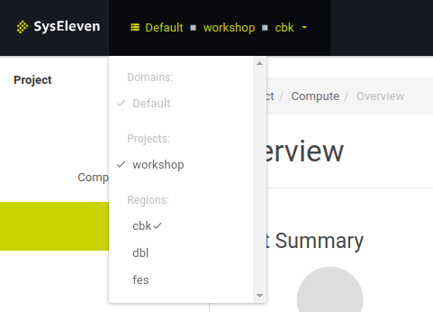
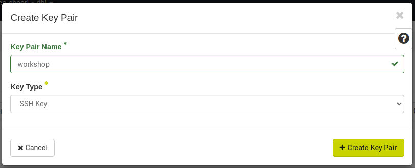
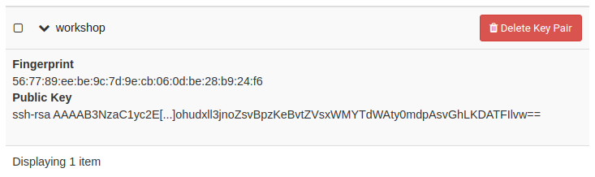
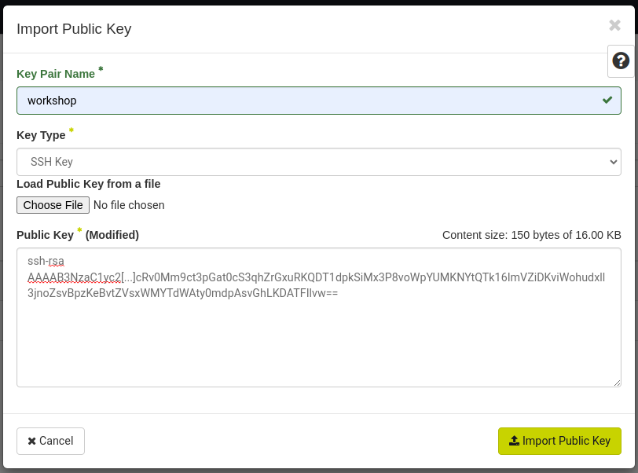

# Add an SSH keypair

## Overview

With this guide you can add an SSH keypair to your Openstack project for SSH connections
on instances.

## Goal

* create a new SSH keypair via Horizon (GUI)
* import an existing SSH public key via Horizon (GUI)

## Preparation

* You need the login credentials for Openstack
  * Username
  * Password
  * Project ID
  * Region Name
* Web browser and basic knowledge using a Linux terminal and SSH

---

### Login

* Visit the URL https://cloud.syseleven.de

* log in with your credentials
  * User Name: `<Username>`
  * Password: `<Password>`
* click "Sign In"

### Select region

* First check if you are logged in to the correct region and maybe switch region

### Option 1 - Create SSH keypair

* click "Compute" --> "Key Pairs" to list existing SSH keys
* click "Create Key Pair"

* Enter a `Key Pair Name` name for it and type `workshop`.
* As `Key Type` choose `SSH Key`
* click **Create Key Pair**

* View the keypair details in the list.

---

### Option 2 - Import SSH keypair

* click "Compute" --> "Key Pairs" to list existing SSH keys
* click "Import Public Key"

* Enter a `Key Pair Name` name for it and type `workshop`.
* As `Key Type` choose `SSH Key`
* Optionally choose a file from your local machine or
* paste the public key into the textfield
* click **Import Key Pair**

* View the keypair details in the list.
