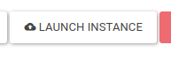
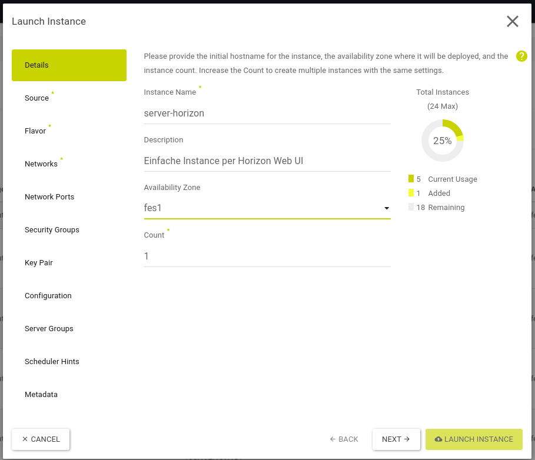
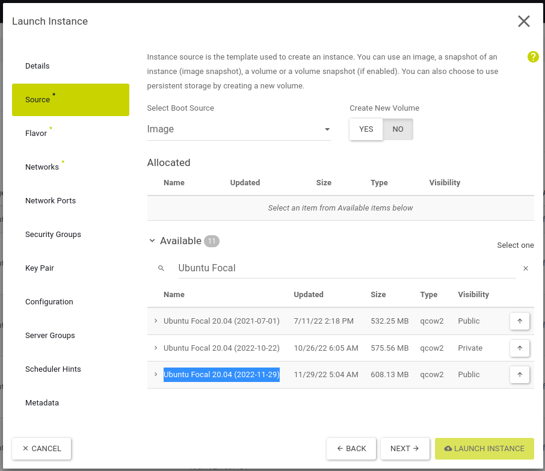
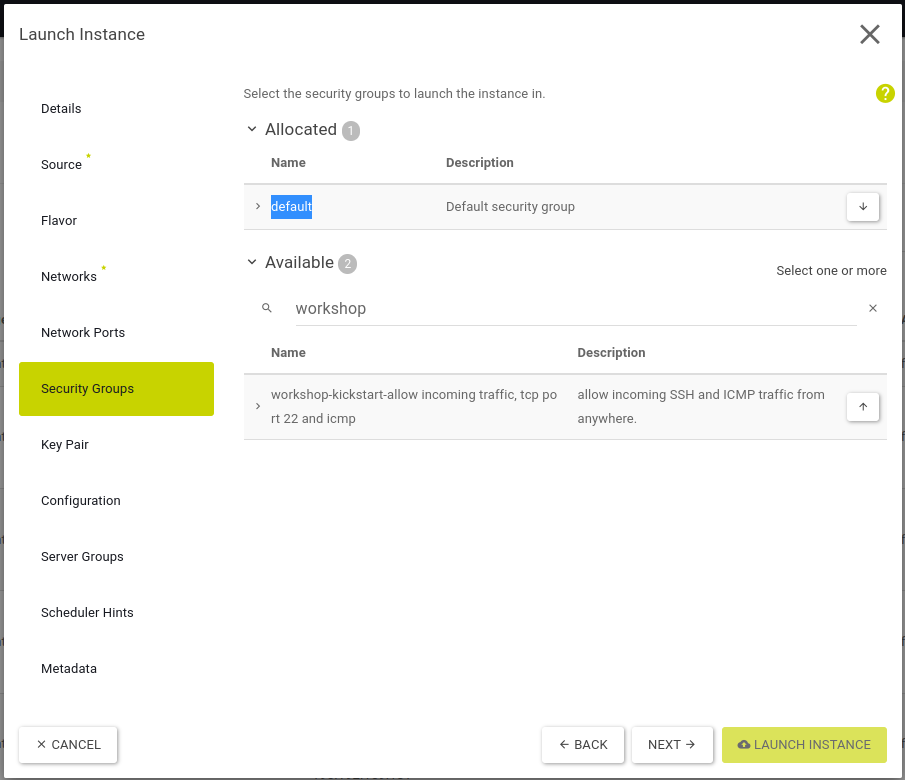
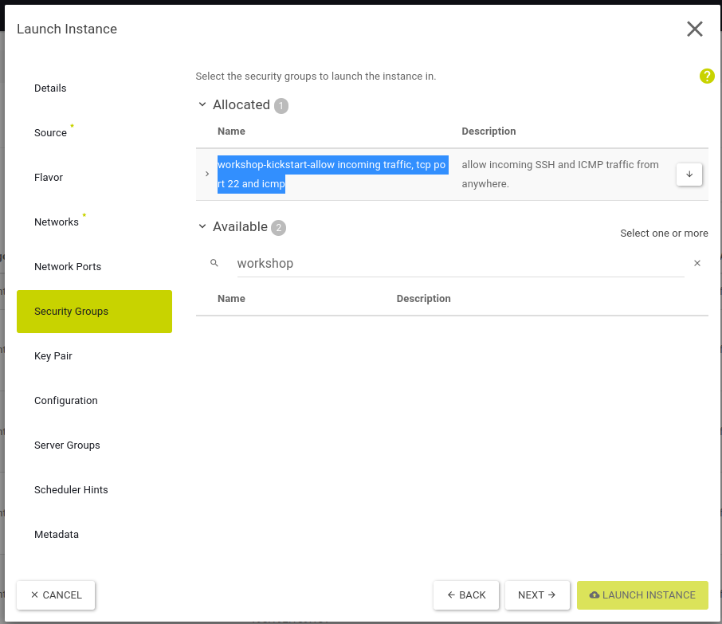
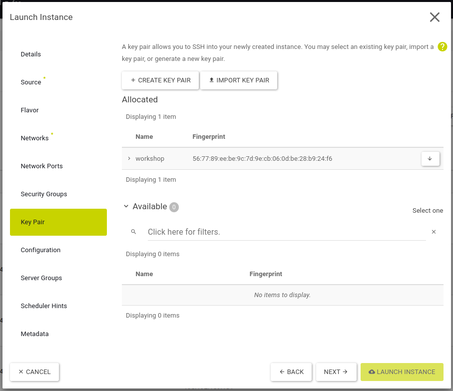

# Creating an instance via Horizon dashboard

## Overview

With this guide you can create a single instance via Horizon Web UI.

## Goal

* Create a single instance via Horizon Web UI

## Preparation

* You need your login credentials for Openstack
  * Username
  * Password
  * Project ID
  * Region name
* previously installed infrastructure from the lab [01-erster-login-und-jumphost](/01-erster-login-und-jumphost)

---

## Start

* Log into https://cloud.syseleven.de Horizon Web UI with your credentials.

* Check if you are in the correct region. If not please switch region.

---

## Create an instance

* Click **Project** --> **Compute** --> **Instances**
* Click the button **LAUNCH INSTANCE**

---

* Enter `server-horizon` as **Instance Name** and
* optionally enter a description under **Description**
* choose the name of your assigned **Region** as **Availability Zone** and
* leave the **Count** at `1`
* click **NEXT**

---

* leave the following settings unchanged:

* **Select Boot Source**: `Image`
* **Create New Volume**: `NO`

* Now choose an arbitrary image `Ubuntu Focal (...)` and activate it via the arrow symbol (upwards)
* click **NEXT**

---

* select `m1.tiny` from the flavor list and activate it by the arrow (upwards)
* click **NEXT**

---

* select from the list the previously created network [01-erster-login-und-jumphost](/01-erster-login-und-jumphost) 
 `workshop-kickstart-net` and 
* activate it by clicking the arrow (upwards)
* click **NEXT**

---

* the section **Network Ports** does not need to be configured in this workshop
* click **NEXT**

---

* remove the **Security Group** `default` by clicking the arrow (down)

* activate the existing **Security Group** `workshop-kickstart-allow ...` by clicking the arrow (up)
* click **NEXT**

---

* select the existing key pair `workshop` and
* activate it by clicking the arrow (up)
* all the other settings are not required for this lab
* click **LAUNCH INSTANCE**

---

### What did you notice?

* the instance has no public IP address

### Other tasks

* display the instance in Hoirzon and note its IP address
* check the instance in the network topology
* use the jumphost to log in to the instance

`ssh ubuntu@<Instance-IP>`

* why is the username `ubuntu`?
